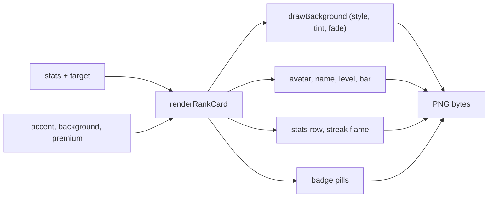

# Architecture

How the rank card is put together. For running it, see the [README](../README.md).

## Shape

One function, `renderRankCard(target, stats, accent, background, backgroundColor, fade, premium)`, in
`src/presentation/components/cards/RankCard.js`. It draws onto a canvas (`@napi-rs/canvas`) and returns PNG
bytes. It reads no database and calls no Discord API: the caller passes plain data, which is what makes it
easy to run and to test.

## Layout

The card is 900 by 320 logical units, drawn at a scale of 2 so it stays crisp on high-DPI screens. Positions
are named constants, not raw pixels. Text is measured before it is placed: a long or wide-glyph name is
truncated to the room it has (`truncateToWidth`), and badge pills flow left to right and drop from the end
when they do not fit (`layoutPills`).

## Data the card draws from

- **Level and progress** come from `src/shared/format/level.js` (the level curve) and are formatted by the
  same module.
- **Listening time** is formatted by `src/shared/format/duration.js`.
- **Badges** are the earned tiers from `src/domain/badges.js`: listening time, tracks played and vote
  streaks, each in five metal tiers. Their art is `resource/emojis/badge_*`.
- **The streak flame** on the day-streak figure changes tier at 3, 7, 14, 30 and 100 days.
- **Background styles** are listed in `src/domain/constants/CardBackgrounds.js` and drawn by
  `drawBackground`. A background is drawn first, then veiled, so any tint is safe under the text.

The bot and the website use some of the same modules, which is why a change to a threshold, a tier or the
level curve is a change to more than the card.

## Robustness

- **Avatars** are fetched with a timeout and a size limit, and a failure draws the initial instead: a slow or
  hostile avatar server can't hang the command.
- **Colours** are validated. An accent or background colour that isn't a hex colour falls back to the
  default rather than throwing inside a gradient.
- **Fonts and badge art** are loaded once and cached; a missing file degrades to a plain pill or the system
  font instead of failing the render.

## Premium

The crown is drawn when the caller passes `premium: true`. Whether someone is premium is decided by the bot,
not here: the card holds no entitlement logic and ignores any `premium` field in `stats`.
